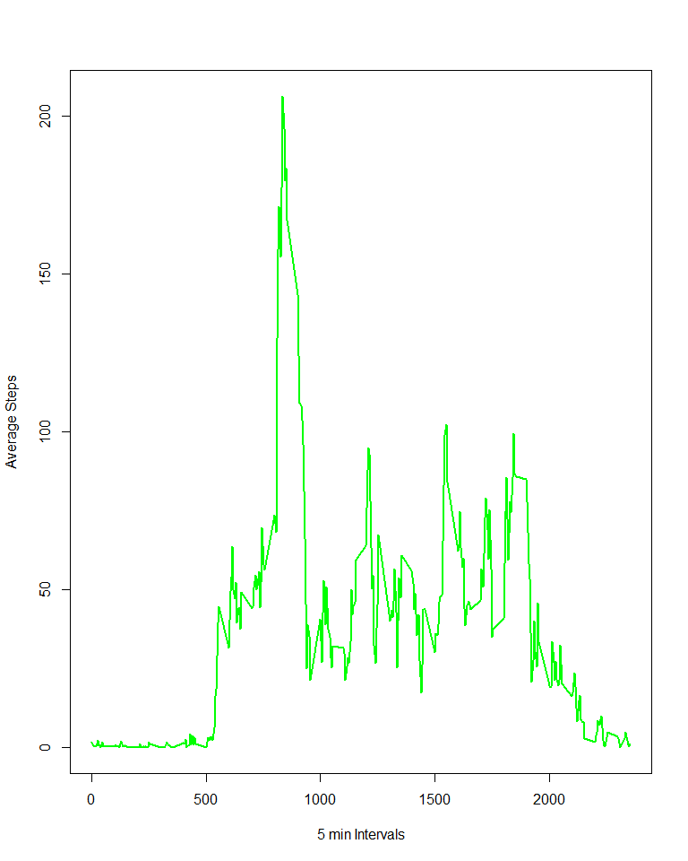
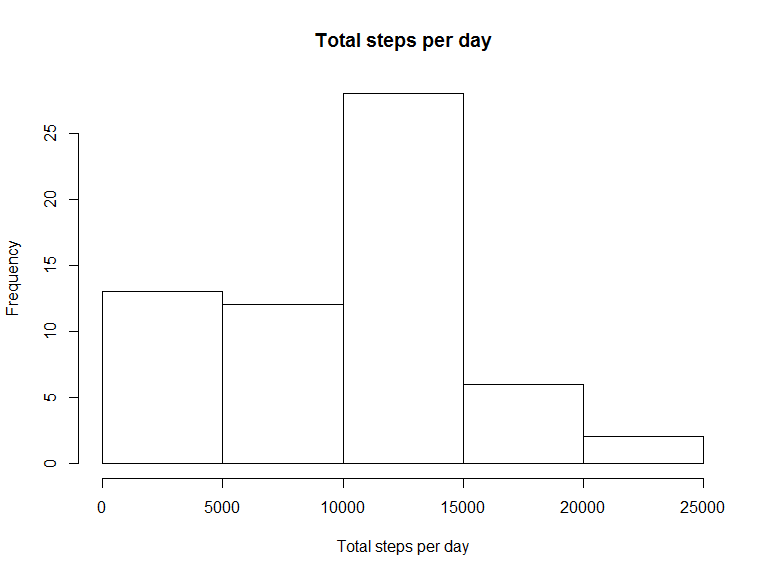
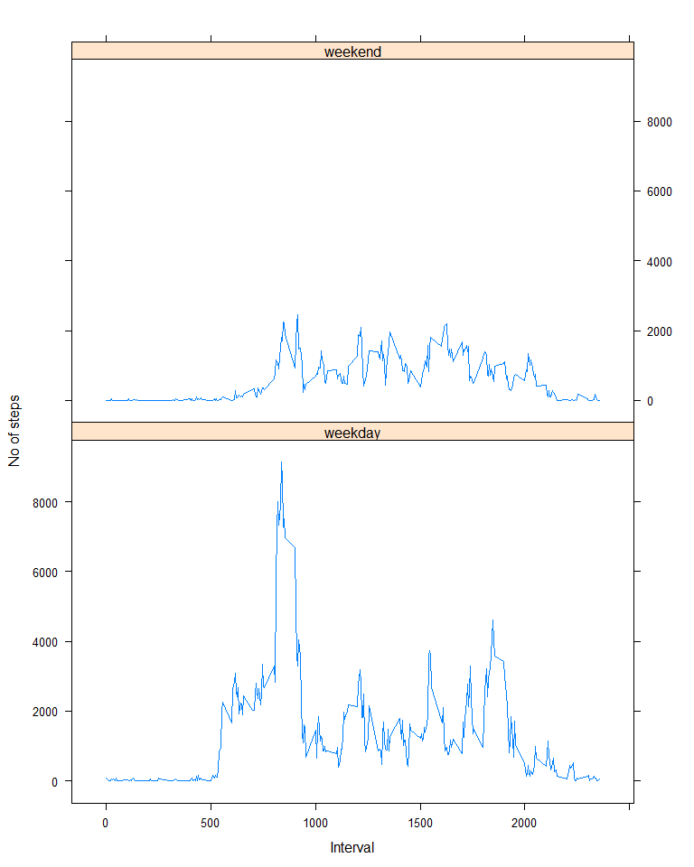

# Activity Monitoring Analysis
Ayesha  
December 11, 2015  

**Following Libraries are needed. **

```r
library(dplyr)
library(lattice)
```

**Loading and preprocessing the data**

Load data into workspace


```r
activity_df <- read.csv("activity.csv")
```


**What is mean total number of steps taken per day?**


```r
bydate.activity <- group_by(activity_df,date)

byday.total <- summarise(bydate.activity , total_steps= sum(steps, na.rm = TRUE))

mean_steps <- mean(byday.total $total_steps)
print(paste("Mean total number of steps per day is: ",  mean_steps))
```

```
## [1] "Mean total number of steps per day is:  9354.22950819672"
```

```r
meadian_steps <- median(byday.total$total_steps)
print(paste("Median total number of steps per day is: ",  meadian_steps))
```

```
## [1] "Median total number of steps per day is:  10395"
```


```r
hist(byday.total$total_steps, xlab="Total steps per day", main = "Total steps per day")
```

 


**What is the average daily activity pattern?**


```r
which.interval <- group_by(activity_df,interval)
by.activity.average <- summarise(which.interval, average_steps= mean(steps, na.rm = TRUE))

most_active_interval <- by.activity.average[which.max(by.activity.average$average_steps),]$interval


print(paste("Most active 5 minute interval is: ", most_active_interval))
```

```
## [1] "Most active 5 minute interval is:  835"
```


```r
plot(by.activity.average$interval, by.activity.average$average_steps, type="l", xlab="5 min Intervals", ylab= "Average Steps", col="green" , lwd=2)
```

 

**Imputing missing values**


```r
NA_count <- sum(!complete.cases(activity_df))

print(paste("Total number of NA values is: ", NA_count))
```

```
## [1] "Total number of NA values is:  2304"
```

**NA filling strategy **

We need to fill the NA values with some appropriate data. We decided to do the simplest thing. Fill all NA spots with zeros. 

Following code creates a new data set with NA filled spots. 


```r
activity_df$steps <- ifelse(is.na(activity_df$steps), 0, activity_df$steps)
```

**Histogram of the total number of steps taken each day **


```r
bydate.activity3 <- group_by(activity_df,date)
by_day_total3 <- summarise(bydate.activity3 , total_steps= sum(steps))
```


```r
hist(byday.total$total_steps, xlab="Total steps per day", main = "Total steps per day")
```

 


**Mean and median total number of steps taken per day **


```r
mean_steps3 <- mean(by_day_total3$total_steps)

print(paste("Mean total number of steps per day: ",mean_steps3))
```

```
## [1] "Mean total number of steps per day:  9354.22950819672"
```

```r
meadian_steps3 <- median(by_day_total3$total_steps)

print(paste("Median total number of steps per day: ",meadian_steps3))
```

```
## [1] "Median total number of steps per day:  10395"
```

There is no difference as we filled NA values with zeros. 

**Are there differences in activity patterns between weekdays and weekends?**

Following code creates a factor variable for day type and compute mean by the daytype


```r
activity_df$daytype <- ifelse(weekdays(as.Date(activity_df$date)) %in% c("Saturday","Sunday"), "weekend","weekday")
by.interval4 <- group_by(activity_df,interval, daytype)

by.interval4.total <- summarise(by.interval4, total_steps= sum(steps, na.rm = TRUE))

by.interval4.total <- transform(by.interval4.total,daytype=factor(daytype))
```

**Panel plot containing a time series plot (i.e. type = "l") of the 5-minute interval (x-axis) and the average number of steps taken, averaged across all weekday days or weekend days (y-axis).**


```r
p<-xyplot(by.interval4.total$total_steps~by.interval4.total$interval|by.interval4.total$daytype,by.interval4.total, layout=c(1,2),type='l',xlab = "Interval",ylab="No of steps")
print(p)
```

 

